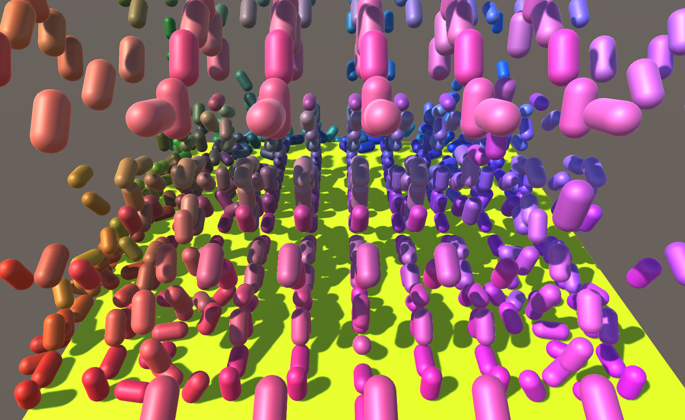

# MultiObjects_XYZ "showALot"

automatic 3D MultiObjects with physics in X/Y/Z in C# with Unity.
Lecture Example Master File[^1] and [^2].



1. create a prefab (showALot)
   - with physics (rigidBody)
1. clone the prefab in the 3 room X/Y/Z (see code example)
   - Instantiate (clone)
   - get renderer
   - change color 


## prefab: ShowALot 

## C# Code: MultiObject.cs 
```
GameObject clone;
Vector3 goVector = new Vector3(runx, (runy+5)/5F, runz);
clone = (GameObject) Instantiate(showALot, goVector, Quaternion.identity);

rend = clone.GetComponent<Renderer>();
Color aColor = new Vector4((runx+5)/10F, (runy-1)/20F, (runz+5)/10F, 1);
rend.material.SetColor("_Color", aColor);
```

[^1]: \01_unity\0000_master_files\C#_v10\Assets\Scripts\Medien
[^2]: \01_unity\2021_dmt3\ex11_codeing\Assets\Scripts\MultiObject.cs


